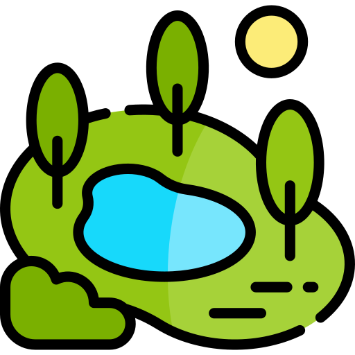
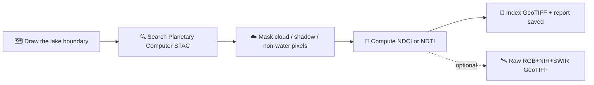
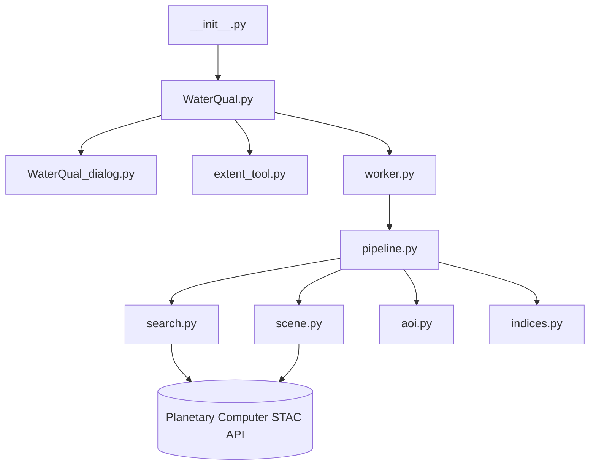

<p align="center">
  
</p>

<h1 align="center">WaterQual</h1>

<p align="center">Sentinel-2 water quality monitoring for lakes, straight inside QGIS.</p>

<p align="center">
  <a href="LICENSE"></a>
  
  <a href="https://waterqual.readthedocs.io/en/latest/?badge=latest"></a>
  
</p>

A QGIS 3 plugin that searches [Microsoft Planetary Computer](https://planetarycomputer.microsoft.com/)
for the least-cloudy Sentinel-2 L2A scene over your lake and date, masks clouds/shadows and
non-water pixels, and computes one of four water-quality algorithms — **NDCI** and **NDTI**
(quick unitless chlorophyll-a/turbidity proxies) or **OC3** and **Gilerson** (calibrated
chlorophyll-a estimators for clear vs. turbid water) — as a georeferenced GeoTIFF with a
plain-text report of summary statistics.

**No account or API key required.** Sentinel-2 is in Planetary Computer's open, public collection
tier — the plugin queries the STAC API and signs asset URLs anonymously. Draw your lake on the
map, pick a date and an algorithm, click Run.



## Is this useful, or just a novelty?

All four algorithms are established, peer-reviewed methods — not something invented for this
plugin — but most people who want them from Sentinel-2 today have to write Python against a STAC
API, use SNAP, or pay for a hosted platform. This plugin's value is closing that accessibility
gap: draw a lake, pick a date and an algorithm, get a screening-grade reading and a report,
without leaving QGIS or writing code.

**Be clear about what this is not.** NDCI and NDTI are unitless, relative proxies — not
calibrated mg/m³ chlorophyll-a or NTU turbidity. OC3 and Gilerson do output mg/m³, but with
published *example* coefficients, not calibrated for any specific lake — treat their numbers as
relative too until you calibrate against real water samples from your own lake. Treat every
output as a screening and trend-monitoring tool (useful for spotting *when* and *where* to send
someone to take a real water sample), not as a replacement for laboratory analysis in any
decision with legal, health, or regulatory consequences. Sentinel-2's 10 m resolution also means
small ponds or narrow channels may not have enough clean water pixels for a stable reading. See
[How it works](#-how-it-works--the-four-algorithms-explained) below for the full picture.

## ✨ Features

- **Four water-quality algorithms** — NDCI and NDTI (quick unitless chlorophyll-a/turbidity
  proxies, no calibration needed) plus OC3 and Gilerson (calibrated chlorophyll-a estimators for
  clear vs. turbid water), each with an in-dialog ⓘ tooltip explaining the formula, what it
  measures, and its literature reference.
- **Restricted to actual water pixels** — uses the Sentinel-2 SCL band's "Water" class by
  default, so results reflect the waterbody itself, not surrounding land or vegetation.
- **Optional raw imagery companion** — tick "Also download raw satellite data" to also save an
  RGB+NIR+SWIR GeoTIFF of the same scene, so you can visually monitor what's driving a reading,
  not just get a number.
- **Two ways to define the area of interest** — rubber-band a rectangle on the canvas, or pick an
  existing polygon layer; the output is clipped exactly to that polygon, not just its bounding box.
- **Advanced options tucked away** — cloud/shadow masking and cloud-percentage thresholds live in
  a collapsed "Advanced masking options" panel with sane defaults, expandable only if you need it.
- **Two cloud thresholds** — a tile-level pre-filter for the STAC search, and a stricter
  AOI-specific tolerance that skips the run outright if exceeded.
- **Largest-overlap tile selection** — each search returns one Sentinel-2 tile, so if your lake
  is bigger than that or straddles a tile boundary, the plugin picks the scene covering the most
  of your AOI (not just the least cloudy one) and warns you if the result still doesn't cover it.
- **Runs in the background** — a `QThread` worker keeps the QGIS UI responsive, with a live
  progress bar and status messages.
- **Always writes a report** — statistics are saved even when a scene is rejected for being too
  cloudy or having no water pixels, so you know why.

## 📦 Installation

**From a ZIP file**

1. Build the ZIP with `./build_plugin.sh` (see [Development](#️-development-setup) below), or
   download a release from the [GitHub repository](https://github.com/iliasmachairas/WaterQual).
2. In QGIS: **Plugins → Manage and Install Plugins → Install from ZIP**.
3. Select the ZIP and click **Install Plugin**.

**Dependencies**

Open the OSGeo4W Shell that ships with QGIS (so packages land in QGIS's own Python, not your
system one) and run:

```bash
pip install shapely requests
```

GDAL and NumPy are already available to QGIS's Python in any standard QGIS install.

## 🚀 Usage

1. Open the plugin from the toolbar icon or **Plugins → WaterQual**.
2. Pick a **date** and a **±day search window**.
3. Choose an algorithm — **NDCI**, **NDTI**, **OC3**, or **Gilerson** (hover the ⓘ next to each).
4. Click **Start drawing** and drag a rectangle over the lake, or select an existing polygon
   layer.
5. (Optional) Expand **Advanced masking options** to change cloud masking or thresholds.
6. Set an **output folder**, then click **Run**.

Full walkthrough: **[waterqual.readthedocs.io](https://waterqual.readthedocs.io)**
(source in [`docs/`](docs/) — connect this repo at readthedocs.org to publish it).

### Output

| File | Description |
|---|---|
| `<tile>_<date>_<ALGO>.tif` | Single-band index GeoTIFF (NDCI or NDTI), NaN outside the mask |
| `<tile>_<date>_<ALGO>_rgb_nir_swir.tif` | Raw imagery companion (if enabled) |
| `<tile>_<date>_<ALGO>_report.txt` | Cloud/water statistics, index mean/min/max/std, classification |

If the best available scene exceeds your cloud tolerance, or no water pixels remain in the AOI,
only the report is written.

## 🔬 How it works — the four algorithms explained

All four are band-math formulas over Sentinel-2 surface reflectance. Water absorbs and scatters
light differently depending on what's suspended or dissolved in it; each algorithm isolates a
different signal. NDCI/NDTI are simple *normalized difference* ratios (same principle as NDVI for
vegetation) — unitless, no calibration needed. OC3/Gilerson are calibrated log-space regressions
that output an actual mg/m³ chlorophyll-a estimate, but only as accurate as their coefficients —
see the caveat under each.

### Chlorophyll-a proxy — NDCI *(quick, unitless)*

```
NDCI = (B05 − B04) / (B05 + B04)
```

`B05` is Red Edge 1 (~705 nm), `B04` is Red (~665 nm). Chlorophyll-a has a reflectance peak near
the red edge from algal-cell scattering, next to a strong absorption trough in the red — the
contrast tracks chlorophyll-a even in sediment-laden inland water where simpler ocean-color
algorithms break down. **Higher NDCI** → more chlorophyll-a / greater bloom potential.

*Mishra, S. & Mishra, D.R. (2012). Remote Sensing of Environment, 117, 394-406.*

### Turbidity proxy — NDTI *(quick, unitless)*

```
NDTI = (B04 − B03) / (B04 + B03)
```

`B04` is Red (~665 nm), `B03` is Green (~560 nm). Suspended sediment brightens red faster than
green as turbidity rises. **Higher NDTI** → more suspended sediment / lower water clarity.

*Lacaux, J.P. et al. (2007). Remote Sensing of Environment, 106(1), 66-74.*

### Clear-water chlorophyll — OC3 *(calibrated, mg/m³)*

```
OC3 = 10^(a0 + a1·X + a2·X² + a3·X³ + a4·X⁴),  X = log10(max(B01,B02) / B03)
```

A blue/green ratio from NASA's ocean-color algorithm family, built for open-ocean/clear inland
water. Chlorophyll absorbs blue light, so the Blue/Green ratio falls as chlorophyll rises.
Weakness: turbid water's suspended sediment also affects blue/green reflectance, biasing OC3 in
non-clear lakes — use Gilerson there instead.

*O'Reilly, J.E. et al. (1998). Journal of Geophysical Research, 103(C11), 24937-24953.*

### Turbid-water chlorophyll — Gilerson *(calibrated, mg/m³)*

```
Gilerson = 10^(b0 + b1·X + b2·X²),  X = log10(B05 / B04)
```

A red/red-edge ratio built specifically for turbid, algae-rich inland/coastal water. Red sits in
chlorophyll's strongest absorption band; Red Edge rises with algal-biomass scattering, so the
ratio tracks chlorophyll even when sediment is also present.

*Gilerson, A.A. et al. (2010). Optics Express, 18(23), 24109-24125.*

**⚠️ Calibration caveat for OC3 and Gilerson:** the coefficients shipped in this plugin are the
algorithms' published *example* values — not calibrated for any specific lake. Their mg/m³ output
should be treated as a relative screening signal, not an accurate reading, until you calibrate
locally against in-situ water samples. NDCI and NDTI don't have this problem (they're relative by
design), which is why they're offered too.

Full formulas, computation pipeline, and limitations: [`docs/algorithms.rst`](docs/algorithms.rst).

## 🛠️ Development setup

This plugin's working copy lives directly under the QGIS profile's plugin folder, so edits take
effect on the next reload — no build/deploy step:

```
.../AppData/Roaming/QGIS/QGIS3/profiles/default/python/plugins/water_qual
```

Install the [Plugin Reloader](https://plugins.qgis.org/plugins/plugin_reloader/) QGIS plugin and
assign it a shortcut to reload WaterQual after saving changes, without restarting QGIS.

### Packaging a release ZIP

```bash
./build_plugin.sh            # build zip + git commit/push
./build_plugin.sh --no-git   # just build the zip, skip git steps
```

Drops `WaterQual-<version>.zip` in `~/Downloads`, ready to upload at
[plugins.qgis.org/plugins/add](https://plugins.qgis.org/plugins/add/).

## 🏗️ Architecture



```
__init__.py               -> classFactory(iface)
WaterQual.py               -> main plugin class (initGui/unload/run), wires the dialog
WaterQual_dialog.py        -> QDialog: typed getters/setters over the Qt Designer UI
WaterQual_dialog_base.ui   -> Qt Designer UI file
extent_tool.py             -> rubber-band AOI drawing tool for the map canvas
worker.py                  -> QThread wrapping pipeline.py, emits progress/status/result
pipeline.py                -> orchestrates search -> masking -> index computation -> save
indices.py                 -> NDCI / NDTI / OC3 / Gilerson formulas, classification, water masking
search.py                  -> STAC query + anonymous SAS URL signing
scene.py                   -> GDAL/VSICURL streaming, reprojection, resampling, GeoTIFF write
aoi.py                     -> AOI bounding-box / GeoJSON helper
```

## ⚖️ License

GPL-2.0-or-later. See [`LICENSE`](LICENSE).

## 👤 Authors

Ilias Machairas, Ashish Kuruvila
